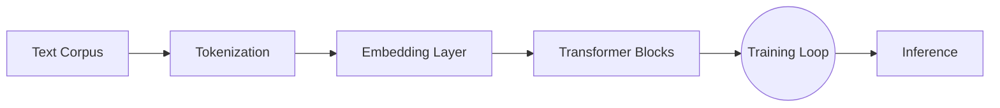
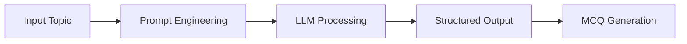
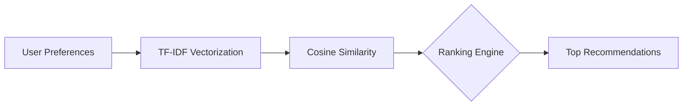
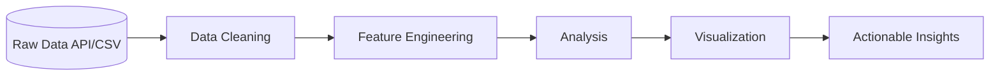
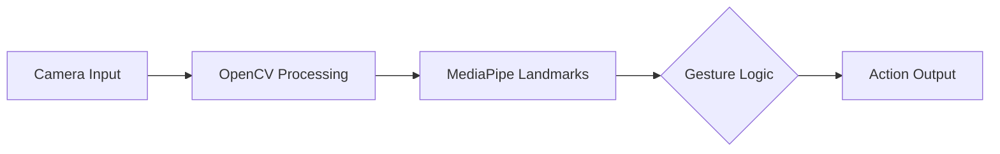
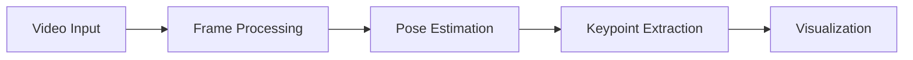
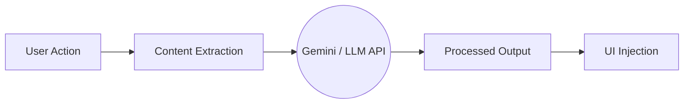
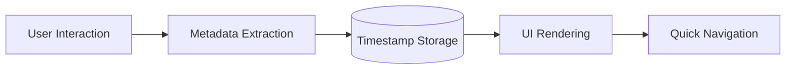

<h1 align="center">Hi 👋, I'm Anmol Rajpoot</h1>

  

  
  
  
  

---

## 🧠 About Me

🎓 Computer Science Undergraduate (Batch 2027) From IIIT Bhopal

🤖 LLMs • RAG • AI Agents • Computer Vision • Data Science
💡 Builder mindset | Problem solver | System thinker

> ⚡ *I don't just train models — I build intelligent systems.*

---

## 🚀 What I've Built

  

  

 

### 🤖 AI Agents & RAG Systems

**🔹 PDF AI Assistant (RAG + Memory)**

```mermaid
graph LR
    A[User Query] --> B[PDF Loader & Chunking]
    B --> C[Sentence Transformers]
    C --> D[(PGVector DB)]
    D --> E{Top-K Retriever}
    E --> F[Groq LLM]
    F --> G[Response & Memory Update]
    style A stroke:#00F7FF,stroke-width:2px
    style D fill:#1e1e1e,stroke:#FFD700,stroke-width:2px
    style G stroke:#00FFB3,stroke-width:2px
```

**🔹 Medical Chatbot (Semantic Retrieval)**

```mermaid
graph LR
    A[User Input] --> B[Text Preprocessing]
    B --> C[Embedding Generation]
    C --> D[(FAISS Vector Search)]
    D --> E{Top-K Context}
    E --> F[LLM Generation]
    style A stroke:#00F7FF,stroke-width:2px
    style D fill:#1e1e1e,stroke:#FFD700,stroke-width:2px
```

### 🧠 LLM Systems

**🔹 LLM from Scratch**

**🔹 AI MCQ Generator**

### 📊 Data Systems

**🔹 Recommendation System**

**🔹 Sales & Economic Analysis**

### 👁️ Computer Vision

**🔹 Gesture Control**

**🔹 Pose Detection**

### 🌐 Chrome Extensions

**🔹 AI Summarizer**

**🔹 YouTube Bookmarking**

## 🤖 AI Agents & Generative AI

- LLM-powered agents with reasoning + tool usage
- RAG pipelines (retrieval + context injection)
- Agent memory (short-term + long-term via vector DB)
- MCP (Modular Control Pipelines)
- Multi-agent workflows
- Diffusion-based generative pipelines

## 🌐 Core Backend & Systems

- REST APIs using FastAPI & Flask
- Scalable backend for AI systems
- CLI tools using Typer
- System design for AI applications

## 🧠 LLMs & Language Systems

- LLM training, fine-tuning & quantization
- Prompt engineering & structured outputs
- Embeddings & semantic search
- Agent orchestration (LangChain, Phidata)

## 🧠 Core Machine Learning & Deep Learning

- ML → Regression, Classification, Clustering
- DL → CNN, RNN, LSTM
- Transformers → Attention, Encoder-Decoder
- Model optimization techniques

## ☁️ DevOps & Cloud

- Docker → containerization
- GCP → deployment
- Linux & Git workflows

## 📊 Data Analytics

- Data preprocessing & cleaning
- EDA & visualization
- Pandas, NumPy, Plotly

## 🌐 Web Technologies & Integrations

- Chrome extensions
- API integrations (Gemini, FRED, OMDb)
- Frontend basics

## 📈 GitHub & Coding Activity

### 🏆 GitHub Dashboard

### 🎯 Problem Solving Profiles

<table>
<tr>
<td align="center">

</td>

<td align="center">

</td>
</tr>
</table>

## 🌱 Currently Learning
- Scalable RAG systems
- Distributed AI systems
- Agent orchestration

## 🤝 Connect

